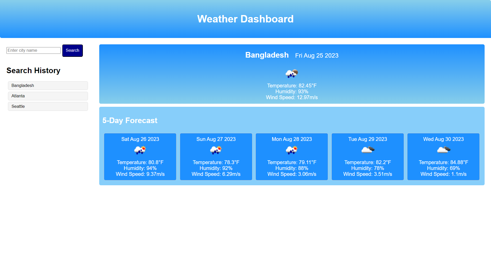

# Weather-Dashboard

## Description
This application allows a user to search cities around the world and see the current weather as well as a 5 day forecast of weather in that city.

## Table of Contents (if applicable)

- [Description](#description)
- [Features](#features)
- [Installation](#installation)
- [Usage](#usage)
- [License](#license)
- [Contact Info](#contact-info)

## Features

- Interactive and responsive site that allows users to search using a third party weather api
- Saves searches to local storage and maintains a clean search history
- Displays dynamically retrieved data of current and 5-day forecasted weather data
- It is responsive and mobile ready and pretty in blue

## Installation

-N/A

## Usage
Click this [link](https://markthos.github.io/Weather-Dashboard/) to the github deployed page.  Begin by searching for any city in the world. When you press enter or search you should see the current weather trends for today with a future forecast for the next 5 days beneath it. Your searches are saved to local storage so you can always revisit previous searches.

## License
This project is covered under the MIT [License](https://choosealicense.com/licenses/${license}).

## Contact Info

- Github: [https://github.com/markthos](https://github.com/https://github.com/markthos)
- Email: aydenthos@gmail.com
